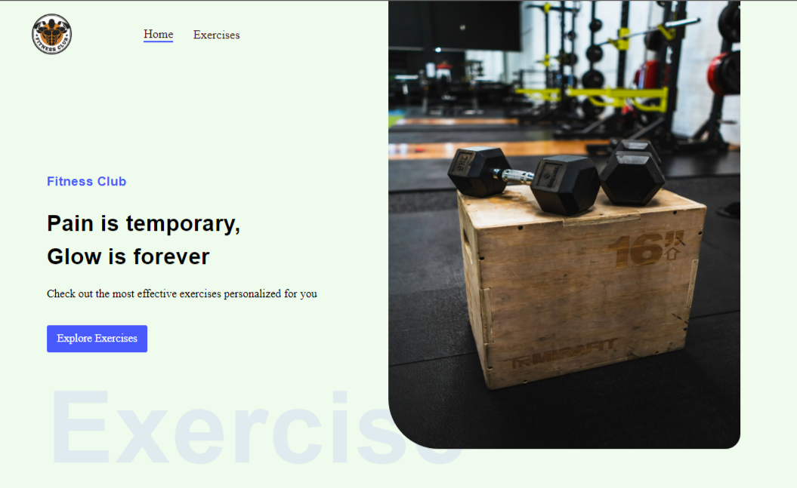
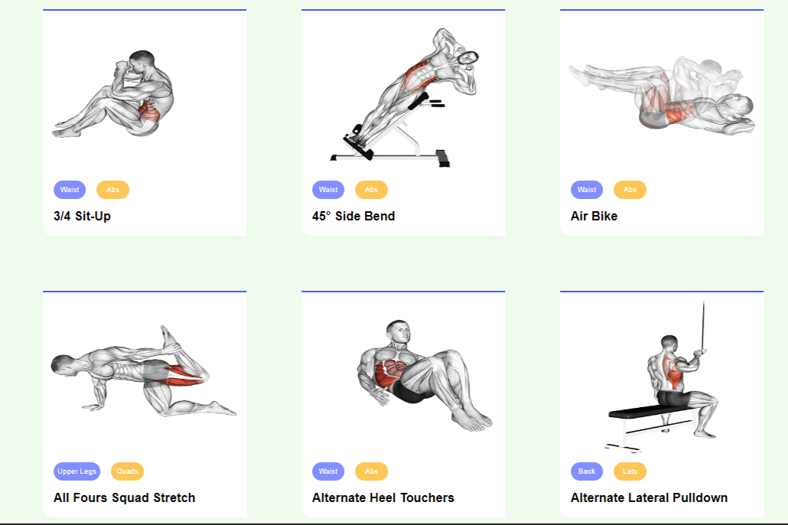

# VirGYM: This is a fitness application built using React

VirGYM is a virtual gym web application that is build using React 18, Material UI and Rapid API.
It is a highly responsive mobile friendly web application that has huge repository of exercises for 
all kinds of body part.

Moreover, for every exercise recommended youtube videos are also shown.

Go checkout the app to explore more features: https://virtual-gym.netlify.app

